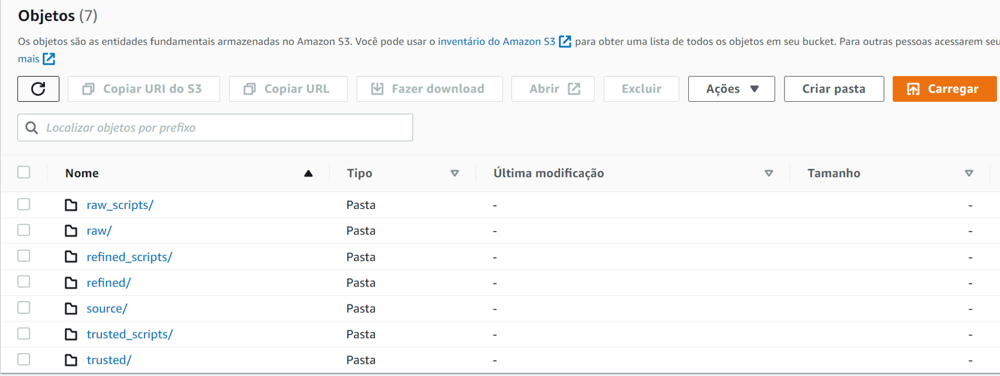
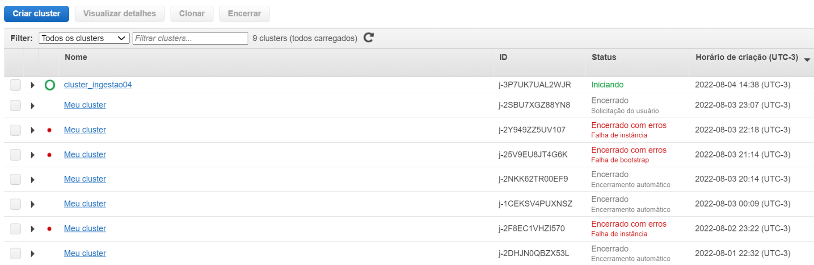
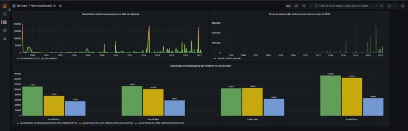
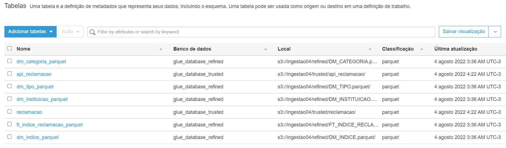

# trabalho04_eEDB_011

Trabalho 04 ministrado pelo professor Leandro Mendes Ferreira no segundo semestre de 2022 - Ingestão de Dados.

O trabalho consiste em realizar ETL:
1) ingerir dados de um CSV e uma API utilizando python
2) criar uma tabela fato utilizando esquema estrela 
3) Subir dados raw no S3
4) Realizar as transformações e inserções na base dimensional
5) Utilizar AWS Glue para documentar Trusted e Refined

## 🚀 Começando

Defininos as seguintes camadas: 

- `Raw`: Pasta para dados brutos
- `Raw_scripts`: Pasta de Códigos para dados brutos
- `Trusted`: Pasta para Dados tratados
- `Trusted_scripts`: Pasta de Códigos para Dados tratados
- `Refined`: Pasta para Dados Dados tratados e modelados
- `Refined_scripts`: Pasta de Códigos para Dados Dados tratados e modelados
- `source`: Dados para extração
- `drivers`: jar para execução de inserção Spark 

## 📋 Implementação

* 1 - Nossa estratégia foi recriar a estrutura de camadas exigidas para as atividades anteriores dentro do S3. Entendemos que o mais adequado seria criar um bucket para cada camada, mas como os código já haviam sido modificados para um único bucket, mantivemos essa estrutura. 

* 2 - AWS EMR para criar um cluster para executar código Python e Spark.
 
 
* 3 - Base MySQL adquirido do provedor UOL em virtude de problemas para acessar a base Mysql do RDS da AWS.
 

* 4 - Grafana para visualização dos dados
 
 
* 5 - MySQL Workbench para verificação do processo de inserção de dados na base uol.
  
 * 6 - AWS Glue para documentação do catálogo de dados.
 Para gerar a documentação do catálogo de dados seguimos o seguinte processo:
   Criar duas bases de dados, uma para cada repositório do S3 que queríamos documentar (trusted e refined)
   Configurar dois crawlers para mapear a estruturas dos dados de cada repositório.
   Iniciar os crawlers que geraram as respectivas tabelas de metadados de cada repositório
 

## Resultados
Acreditamos que atendemos todos os requisitos obrigatórios propostos para a tarefa. 
  Tivemos problemas para acessar a base de dados, por isso recorremos à base do provedor UOL. Além disso, inserir o .jar de acesso do spark ao Mysql também não foi uma tarefa trivial. Mas conseguimos contornar essas dificuldades. Assim, conseguimos atingir a proposta de realizar todas as tarefas de processamento e carga dos dados em ambientes na cloud. 

## 🛠️ Construído com
* [Python](https://www.python.org/) - Linhas de código utilizado para programação;
* [PySpark](https://spark.apache.org/docs/latest/api/python/) - Utilizado para ETL dos dados;
* [MySQL](https://www.mysql.com/) - Utilizado para ETL dos dados;
* [AWS S3](https://aws.amazon.com/pt/s3/) - Utilizado como repositório de dados;
* [AWS EMR](https://aws.amazon.com/pt/emr/) - Utilizado para processamento dos dados;
* [AWS Glue](https://https://aws.amazon.com/pt/glue/?whats-new-cards.sort-by=item.additionalFields.postDateTime&whats-new-cards.sort-order=desc/) - Utilizado para mapeamento do catálogo de dados;

## ✒️ Autores
* [Rodrigo Vitorino](https://github.com/digaumlv)
* [Thais Nabe](https://github.com/thaisnabe)
* [Vitor Marques](https://github.com/vitormrqs)
* [Wesley Lourenço Barbosa](https://github.com/wesleyloubar)
